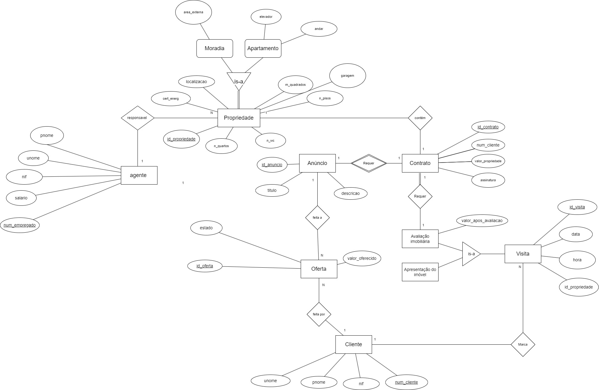
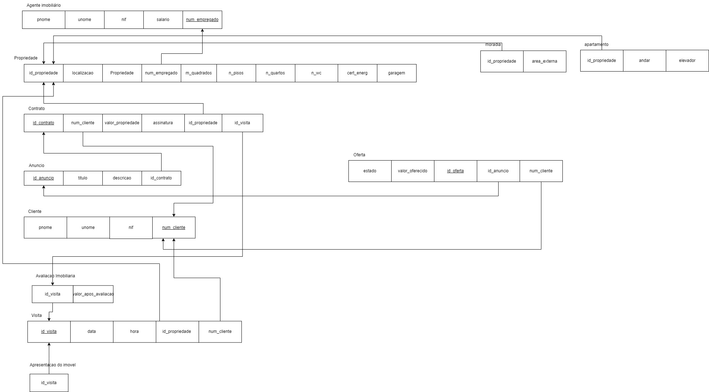

# BD: Trabalho Prático APFE

**Grupo**: P2G6

- Guilherme Santos, MEC: 108810
- José Silva, MEC: 108894

## Introdução / Introduction

A VillaSync tem como objetivo a criação de um sistema para gerir uma empresa de vendas de propriedades de luxo. Para tal, a sua base de dados deve ser capaz de armazenar informação importante de forma segura e acessível para garantir a relação correta entre as entidades. 

## Análise de Requisitos / Requirements

Inserir/remover uma propriedade associada a um contrato
Inserir/remover um contrato associado a uma avaliação imobiliária
Inserir/remover uma visita a uma propriedade (avaliação ou apresentação)
Inserir/remover um anúncio de uma propriedade
Inserir/remover uma oferta feita por um cliente
Alterar o estado de uma oferta
Inserir/remover um cliente e informações associadas
Inserir/remover um agente imobiliário e informações associadas

## DER

## ER

